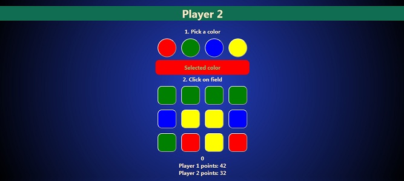

# Color-Lines-Game
My own original game idea written in HTML, CSS, JS
* this game features both: luck and strategy

## Features
* 2-player game with 4x3 gameboard
* points counter up

## How to play
* 2 players play in turn
* first pick a desired color(red, green, blue or yellow)
* select field on gameboard
* picked field will change into selected color
* same time computer will change randomly 3 colors fields on gameboard
* goal is to get 3 or 4 same field in one line(horizontally, vertically or diagonally)
* 3 in a row will give 3 points
* 4 in a row will give 8 points
* whoever gets 100 points is the winner

